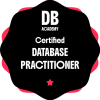
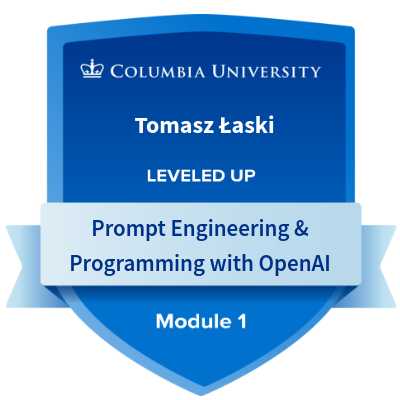
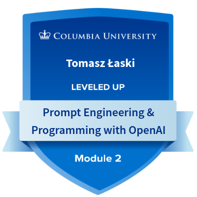

## 👋 Hello!

I'm Tomasz Łaski, an IT professional with a diverse skill set cultivated throughout my journey. I dedicated a year as a software engineer trainee, starting in October 2022 and concluding in October 2023, immersing myself in the dynamic world of technology. Since then, I've been thriving as a software engineer associate, continuously refining my expertise.

## 💻 Technologies I've Worked With

* React
* Angular
* Vite
* MySQL
* MongoDB
* Java
* Docker (basic changes)
* Keycloak
* ChatGPT
* GitHub Copilot
* Bing AI

I believe in continuous learning and practical application, and I'm enthusiastic about the possibilities that lie ahead in my journey as an IT professional.

## 📫 How to Reach Me

* ✉️ Email: tomasz.laski0001@gmail.com
* LinkedIn: [LinkedIn Profile](https://www.linkedin.com/in/tomasz-%C5%82aski-7888b2185/)

## 🏅 Certifications

**Database Practitioner – DB Academy (2026)**  
Foundational knowledge in SQL, database design, query optimization, transaction management and NoSQL models.

---

### Columbia University – Prompt Engineering & Programming with OpenAI

**Completed Modules 1 & 2**  
Focus on:
- OpenAI API usage  
- Prompt design and optimization  
- Controlling model behavior (temperature, tokens)  
- Building AI-driven features  

[View Credential](https://badges.plus.columbia.edu/f7b56abd-d118-4356-a21d-8b310c3ad7b1)
